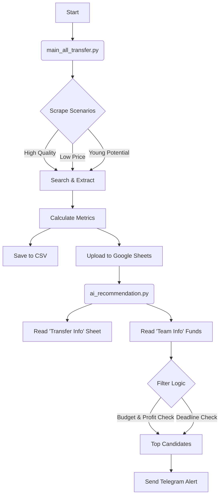

# PManager Scraper & Analyzer

A Python-based toolset for automating player scouting, market analysis, and transfer recommendations for PManager.org.

## 🚀 Features

- **Automated Scraping**: Fetches player data from the transfer market based on multiple criteria:
  - High Quality players
  - Low Price bargains
  - Young Potential talents
- **Market Analysis**: Calculates key financial metrics:
  - **ROI (Return on Investment)**: Percentage profit potential.
  - **Value Diff**: Difference between Estimated Value and Buying Price.
  - **Forecast Sell**: ROI-based prediction of sell price.
- **Filtering**:
  - Filters out players above budget.
  - Checks for profitable "flips" (Buy Low, Sell High).
  - Ensures transfer deadline is within a strategic window (e.g., next 12 hours).
- **Integrations**:
  - **Google Sheets**: Upserts player data to "All Players" and replaces "Transfer Info" for real-time market tracking.
  - **Telegram Bot**: Sends automated alerts for the top 15 day-trade signals.
- **History Tracking**:
  - **Final Price Scraping**: Automatically records the final sold price after auctions end.
  - **Market Ratios**: Calculates `Sale Price / Scout Estimate` ratio to gauge market heat.

## 📚 Documentation
- [Business Requirements (BRD)](docs/BRD.md)
- [Product Requirements (PRD)](docs/PRD.md)
- [System Design (SDD)](docs/SDD.md)
- [Technical Specs (TSD)](docs/TSD.md)

## 🛠️ Tech Stack

- **Language**: Python 3.9+
- **Libraries**:
  - `pandas` - Data manipulation and CSV export.
  - `beautifulsoup4` - HTML parsing (used in legacy/scraper classes).
  - `requests` - HTTP requests.
  - `gspread` - Google Sheets API interactions.
  - `python-dotenv` - Environment variable management.

## ⚙️ Setup & Installation

1.  **Clone the repository**:
    ```bash
    git clone <repository_url>
    cd pmanager-scrape
    ```

2.  **Install Dependencies**:
    ```bash
    pip install -r requirements.txt
    ```

3.  **Environment Configuration**:
    Create a `.env` file in the root directory (see `.env.example`):
    ```env
    PM_USERNAME=your_username
    PM_PASSWORD=your_password
    TELEGRAM_BOT_TOKEN=your_bot_token
    TELEGRAM_CHAT_ID=your_chat_id
    ```

4.  **Google Credentials**:
    Place your Google Service Account JSON key as `credentials.json` in the root directory.

## 🏃 Usage

### 1. Run the Scraper
Scrapes the transfer market and updates `transfer_targets_all.csv` and Google Sheets.
```bash
python ai_recommendation.py
```

### 3. Run Hourly Updater
Checks for players whose auctions have recently ended, scrapes their final sale price, and updates the historical database.
```bash
python update_final_prices.py
```

## 📂 Project Structure



### Key Files

| File | Description |
| :--- | :--- |
| `main_all_transfer.py` | Main entry point for the scraping process. Manages login, search scenarios, and data upload. |

| `update_final_prices.py` | Runs hourly to harvest final sale prices and calculate market ratios. |
| `ai_recommendation.py` | Reads data from Google Sheets, applies investment logic, and sends Telegram notifications. |
| `main_team_info.py` | Scrapes current team status (funds, roster) to update "Team Info" sheet. |
| `requirements.txt` | Python dependency list. |

## 📊 Data Flow

1.  **Scraping**: `main_all_transfer.py` logs in and iterates through search URLs.
2.  **Processing**: Data is cleaned, and financial metrics (`value_diff`, `roi`) are calculated.
3.  **Storage**:
    *   `transfer_targets_all.csv` (Local backup)
    *   Google Sheets: "All Players" (Historical db), "Transfer Info" (Current market)
4.  **Action**: `ai_recommendation.py` reads "Transfer Info", checks against your current "Available Funds" in "Team Info", and alerts you to the best deals ending soon.
