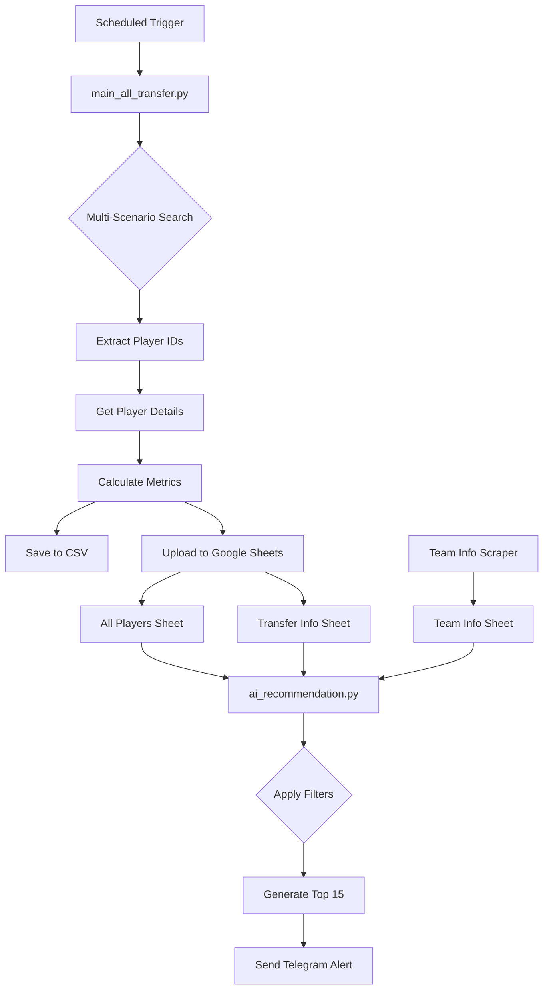

# Product Requirements Document (PRD)
## PManager Scraper & Analyzer

---

## 1. Product Overview

**Product Name:** PManager Scraper & Analyzer  
**Type:** Python-based Automation Toolset  
**Target Platform:** macOS / Linux / GitHub Actions  

A comprehensive automation suite for PManager.org football manager game that scrapes transfer market data, analyzes player values, and delivers actionable investment signals.

---

## 2. Feature Specifications

### 2.1 Transfer Market Scraper

**Module:** `main_all_transfer.py` + `scraper_all_transfer.py`

| Feature | Description |
|---------|-------------|
| **Multi-Scenario Search** | Scrapes players across 4 search filters (High Quality, Low Price, Young Potential, Recent Listings) |
| **Player Details Extraction** | Retrieves name, position, age, nationality, skills, quality ratings |
| **Financial Data** | Captures estimated value, asking price, current bids, deadline |
| **Pagination Handling** | Iterates through up to 150 pages per search scenario |

**Calculated Metrics:**

| Metric | Formula |
|--------|---------|
| `buy_price` | max(asking_price, bids_avg) |
| `value_diff` | estimated_value - buy_price |
| `roi` | (value_diff / buy_price) × 100 |
| `forecast_sell` | (estimated_value / 2 × 0.8) - buy_price |

---

### 2.2 AI Recommendation Engine

**Module:** `ai_recommendation.py`

| Feature | Description |
|---------|-------------|
| **Budget Filter** | Excludes players above current available funds |
| **Profit Filter** | Only includes players with forecast_sell > 0 |
| **Deadline Filter** | Focuses on auctions ending within 12 hours |
| **Time Zone Handling** | Converts UTC deadlines to Thailand Time (UTC+7) |
| **Ranking** | Sorts candidates by forecast profit (descending) |

**Output:** Top 15 day-trade signals sent to Telegram.

---

### 2.3 Team Info Tracker

**Module:** `main_team_info.py` + `scraper_team_info.py`

| Data Point | Description |
|------------|-------------|
| Team Name | Current team identity |
| Available Funds | Budget for transfers |
| Financial Situation | Stability indicator |
| Wage Info | Sum and roof for salaries |
| Players Value | Total squad valuation |

---

### 2.4 Opponent Scout

**Module:** `main_opponent_scout.py` + `scraper_opponent.py`

| Feature | Description |
|---------|-------------|
| **Team Analysis** | Extract all player IDs from opponent team page |
| **Database Cross-Check** | Compare against existing "All Players" watchlist |
| **Match Report** | Identify if any opponent players are already tracked |

---

### 2.5 Telegram Bot Integration

**Module:** `telegram_bot.py` + `telegram_scout_bot.py`

| Feature | Description |
|---------|-------------|
| **Command: /scout** | Trigger opponent scout via GitHub Actions |
| **Command: /status** | Check if bot is running |
| **Notifications** | Automated alerts for transfer recommendations |

---

## 3. Data Flow



---

## 4. User Stories

| ID | As a... | I want to... | So that... |
|----|---------|--------------|------------|
| US-001 | Manager | See undervalued players on market | I can buy low and sell high |
| US-002 | Manager | Get mobile notifications | I can react quickly to opportunities |
| US-003 | Manager | Filter by my budget | I don't waste time on unaffordable players |
| US-004 | Manager | Track historical player data | I can analyze trends over time |
| US-005 | Manager | Scout opponent teams | I can assess upcoming competition |

---

## 5. Non-Functional Requirements

| Requirement | Specification |
|-------------|---------------|
| **Performance** | Full scrape + analysis in < 30 minutes |
| **Reliability** | Graceful error handling with retry logic |
| **Maintainability** | Modular design with separated scrapers |
| **Scalability** | Handle 500+ players per run |
| **Security** | Credentials stored in .env, not committed |

---

## 6. External Integrations

| Service | Purpose | Authentication |
|---------|---------|----------------|
| **PManager.org** | Data source | Username/Password |
| **Google Sheets** | Data storage | Service Account JSON |
| **Telegram** | Notifications | Bot Token + Chat ID |
| **GitHub Actions** | Scheduled automation | Repository secrets |

---

## 7. Output Specifications

### 7.1 Google Sheets Structure

| Sheet Name | Purpose | Update Mode |
|------------|---------|-------------|
| **All Players** | Historical player database (skills, attributes) | Upsert (merge) |
| **Transfer Info** | Current market snapshot (prices, deadlines) | Replace |
| **Team Info** | Your team's financial status | Replace |

### 7.2 Telegram Message Format

```
🚀 Top 15 Day Trade Signals (Algorithm) 🚀

💰 Budget: 50,000,000 baht
⏰ Time: 14:30

1. *Player Name*
   📉 Buy: 1,000,000 | 💵 Profit: 500,000
   ⏱️ Ends: 12/01 18:00
   🔗 Link: https://...

⚠️ Auto-generated based on (Est. Value/2 * 0.8) - Buy Price
```
