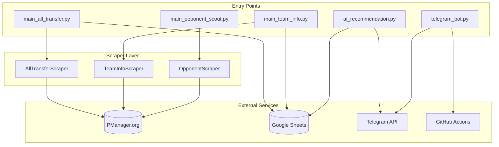
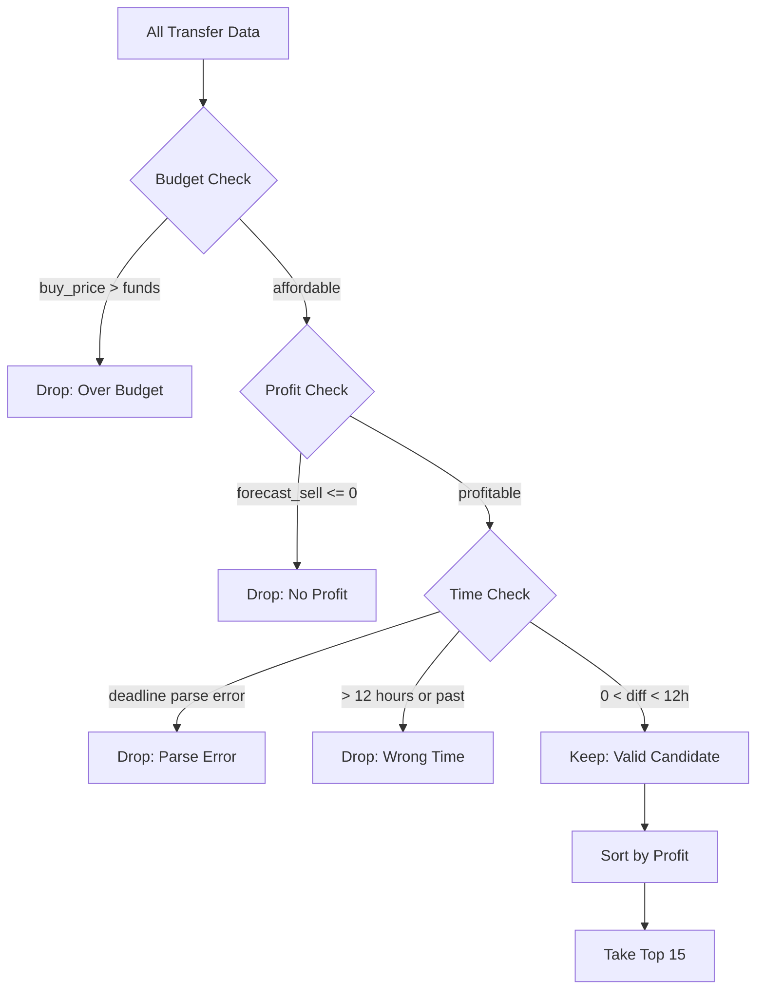
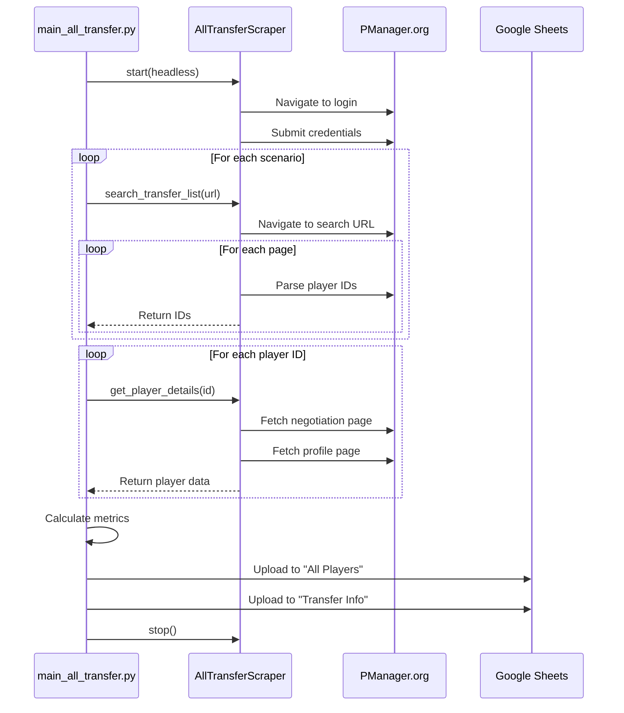
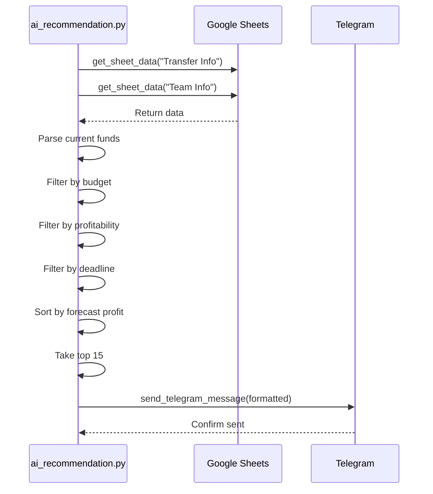

# Software Design Document (SDD)
## PManager Scraper & Analyzer

---

## 1. System Architecture

### 1.1 High-Level Architecture



### 1.2 Component Diagram

| Component | Type | Responsibility |
|-----------|------|----------------|
| `AllTransferScraper` | Class | Browser automation for transfer market |
| `TeamInfoScraper` | Class | Extracts team financial data |
| `OpponentScraper` | Class | Parses opponent team rosters |
| `upload_to_sheets()` | Function | Upserts data to Google Sheets |
| `send_telegram_message()` | Function | Sends notifications via Telegram |

---

## 2. Module Design

### 2.1 scraper_all_transfer.py

**Class: `AllTransferScraper`**

```python
class AllTransferScraper:
    def __init__(self)
    def start(headless: bool) -> None
    def stop() -> None
    def login(username: str, password: str) -> None
    def search_transfer_list(search_url: str, max_pages: int) -> List[str]
    def get_player_details(player_id: str) -> Dict
    def get_player_history(player_id: str) -> int
```

**Method Details:**

| Method | Input | Output | Description |
|--------|-------|--------|-------------|
| `start()` | headless flag | None | Launches Playwright browser |
| `login()` | credentials | None | Authenticates with PManager |
| `search_transfer_list()` | URL, max pages | List of IDs | Paginates through search results |
| `get_player_details()` | player ID | Dict | Scrapes negotiation + profile pages |

---

### 2.2 main_all_transfer.py

**Function: `upload_to_sheets(df, spreadsheet_id, sheet_name)`**

| Step | Action |
|------|--------|
| 1 | Authenticate with Google via service account |
| 2 | Fetch existing records from sheet |
| 3 | Merge new data (upsert by ID) |
| 4 | Clear sheet and upload merged data |

**Financial Calculations:**

```python
buy_price = max(asking_price, bids_avg) if asking_price > 0 else bids_avg
value_diff = estimated_value - buy_price
roi = (value_diff / buy_price) * 100 if buy_price > 0 else 0
forecast_sell = (estimated_value / 2 * 0.8) - buy_price
```

---

### 2.3 ai_recommendation.py

**Filter Pipeline:**



---

## 3. Data Models

### 3.1 Player Data Structure

```python
{
    "id": "123456",                    # Unique player ID
    "name": "João Silva",              # Player name
    "position": "Midfielder",          # Playing position
    "age": "24",                        # Age in years
    "nationality": "Brazil",           # Country
    "team": "FC Example",              # Current team
    "url": "https://...",              # Profile link
    
    # Skills (integer values 1-10)
    "Speed": 8,
    "Technique": 7,
    "Passing": 6,
    # ... other skills
    
    # Ratings
    "Quality": "8",
    "Potential": "9",
    
    # Financial Data
    "estimated_value": 5000000,
    "asking_price": 2000000,
    "bids_count": "3",
    "bids_avg": "1800000",
    "deadline": "Today at 18:00",
    
    # Calculated
    "buy_price": 2000000,
    "value_diff": 3000000,
    "roi": 150.0,
    "forecast_sell": 0,
    "last_updated": "2026-01-12 14:30:00"
}
```

### 3.2 Team Info Structure

```python
{
    "team_name": "FC Example",
    "manager": "User Name",
    "available_funds": "50.000.000 baht",
    "financial_situation": "Stable",
    "wages_sum": "5.000.000 baht",
    "wage_roof": "10.000.000 baht",
    "academy": "Level 5",
    "players_count": "25",
    "age_average": "24.5",
    "players_value": "150.000.000 baht",
    "team_reputation": "Good",
    "current_division": "Division 1",
    "fan_club_size": "10.000"
}
```

---

## 4. Sequence Diagrams

### 4.1 Transfer Scraping Flow



### 4.2 Recommendation Flow



---

## 5. Error Handling

| Error Type | Handling Strategy |
|------------|-------------------|
| Login failure | Raise exception, stop execution |
| Page load timeout | 3-second timeout, skip player |
| Element not found | Return default value ("N/A" or 0) |
| Google Sheets API error | Log error, continue without upload |
| Telegram send failure | Retry as plain text, log if both fail |
| Player details scrape error | Log error, continue to next player |

---

## 6. Configuration

### 6.1 Environment Variables

| Variable | Description | Example |
|----------|-------------|---------|
| `PM_USERNAME` | PManager login | `your_username` |
| `PM_PASSWORD` | PManager password | `your_password` |
| `TELEGRAM_BOT_TOKEN` | Telegram bot token | `123456:ABC...` |
| `TELEGRAM_CHAT_ID` | Telegram chat/group ID | `-100123456789` |
| `GITHUB_TOKEN` | GitHub PAT (for bot) | `ghp_xxx...` |
| `GITHUB_REPO` | Repository name | `user/pmanager-scrape` |
| `CI` | CI environment flag | `true` (auto-set by Actions) |

### 6.2 Hardcoded Configuration

| Constant | Value | Location |
|----------|-------|----------|
| `SPREADSHEET_ID` | `1F8FWV9w1gNAGbGDd6RG929dx2jAcM-N6p2ve9fOwSfU` | Multiple files |
| `max_pages` | `150` | scraper_all_transfer.py |
| Deadline window | `12 hours` | ai_recommendation.py |

---

## 7. Dependencies

| Package | Purpose |
|---------|---------|
| `playwright` | Browser automation |
| `beautifulsoup4` | HTML parsing |
| `pandas` | Data manipulation |
| `gspread` | Google Sheets API |
| `google-auth` | Google authentication |
| `python-dotenv` | Environment variables |
| `requests` | HTTP requests (Telegram) |
