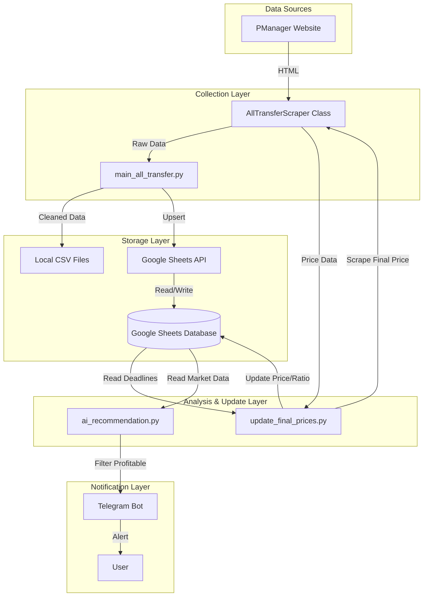

# System Design Document (SDD)
**Project Name:** PManager Open Market Scraper & Analyzer
**Version:** 1.0

## 1. System Architecture

The system follows a modular pipeline architecture where data is harvested, processed, stored, and then successfully acted upon.

### 1.1 High-Level Diagram

## 2. Component Design

### 2.1 Collection Layer (`main_all_transfer.py`)
*   **Responsibility**: Orchestrates the scraping session.
*   **Input**: Search URLs defined in `SCENARIOS`.
*   **Process**:
    1.  Login to PManager.
    2.  Iterate pages (1 to Max).
    3.  Extract Player IDs.
    4.  Visit Player Profiles.
*   **Output**: Dataset of active players.

### 2.2 Storage Layer (Google Sheets)
*   **"All Players" Sheet**:
    *   Acts as the persistent data warehouse.
    *   Primary Key: `id`.
    *   Stores: Attributes, History (`bids_avg`), Final Price (`last_transfer_price`).
*   **"Transfer Info" Sheet**:
    *   Volatile table.
    *   Stores only currently active listings.

### 2.3 Analysis Layer (`ai_recommendation.py`)
*   **Responsibility**: Logic engine for trading decisions.
*   **Logic**:
    *   `Value > Asking Price`
    *   `Budget > Asking Price`
    *   `Deadline < 12 Hours`

### 2.4 Update Layer (`update_final_prices.py`)
*   **Responsibility**: Close the data loop.
*   **Logic**:
    *   Identify players where `Now > Deadline`.
    *   Scrape history.
    *   Calculate `Ratio = Price / ScoutEst`.
